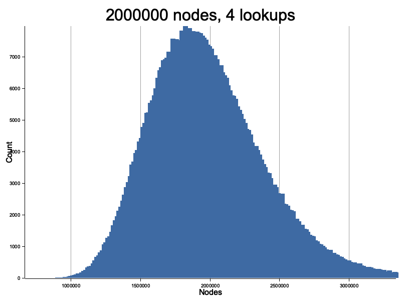
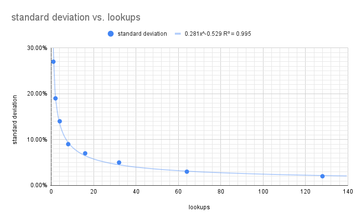

# Dht Size Estimattion

This is a documentation for the Dht size estimation used in this Mainline Dht implementation,
within the context of [Censorship Resistance](../censorship-resistance.md).

If you want to see a live estimation of the Dht size, you can run (in the root directory):

```
cargo run -- example measure_dht
```

## How does it work?

In order to get an accurate calculation of the Dht size, you should take
as many lookups (at uniformly disrtibuted target) as you can,
and calculate the average of the estimations based on their responding nodes.
    
Consider a Dht with a 4 bit key space.
Then we can map nodes in that keyspace by their distance to a given target of a lookup.

Assuming a random but uniform distribution of nodes (which can be measured independently),
you should see nodes distributed somewhat like this:

```md
            (1)    (2)                  (3)    (4)           (5)           (6)           (7)      (8)       
|------|------|------|------|------|------|------|------|------|------|------|------|------|------|------|
0      1      2      3      4      5      6      7      8      9      10     11     12     13     14     15
```

So if you make a lookup and optained this partial view of the network:
```md
            (1)    (2)                  (3)                                (4)                  (5)       
|------|------|------|------|------|------|------|------|------|------|------|------|------|------|------|
0      1      2      3      4      5      6      7      8      9      10     11     12     13     14     15
```

Note: you see exponentially less further nodes than closer ones, which is what you should expect from how
the routing table works.

Seeing one node at distance (d1=2), suggests that the routing table might contain 8 nodes,
since its full length is 8 times (d1).

Similarily, seeing two nodes at (d2=3), suggests that the routing table might contain ~11
nodes, since the key space is more than (d2).

If we repeat this estimation for as many nodes as the routing table's `k` bucket size,
and take their average, we get a more accurate estimation of the dht.

## Formula

The estimated number of Dht size, at each distance `di`, is `en_i = i * d_max / di` where `i` is the
count of nodes discovered until this distance and `d_max` is the size of the key space.

The final Dht size estimation is the least-squares fit of `en_1 + en_2 + .. + en_n`

## Simulation

Running this [simulation](./src/main.rs) for 2 million nodes and a after 16 lookups, we observe:

- Mean estimate: 2,123,314 nodes 
- Standard deviation: 7%
- 95% Confidence Interval: +-14%

Meaning that after 12 lookups, you can be confident you are not overestimating the Dht size by more than 10%,
in fact you are most likely underestimating it slightly due to the limitation of real networks. 



Finally the standard deviation seems to follow a power law `stddev = 0.281 * lookups^-0.529`. Meaning after only 4 lookups, you can get an estimate with 95% confidence interval of +-28%.



## Mapping simulation to real networks

While the Mean estimate in the simulation slightly over estimate the real size in the simulation, the opposite is what should be expected in real networks.

Unlike the simulation above, real networks are not perfect, meaning there is an error factor that can't be hard coded,
as it depends on the response rate of nodes you query, the more requests timeout before you get a response, the more nodes
you will miss, and the smaller you will think the Dht is.

This is an error on the side of conservatism. And I can't think of anything in the real world that could distort the results
expected from this simulation to the direction of overestimating the Dht size.

## Acknowledgment

This size estimation was based on [A New Method for Estimating P2P Network Size](https://eli.sohl.com/2020/06/05/dht-size-estimation.html#fnref:query-count)
